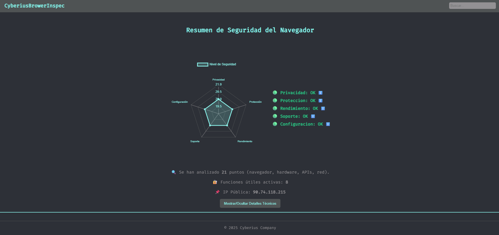
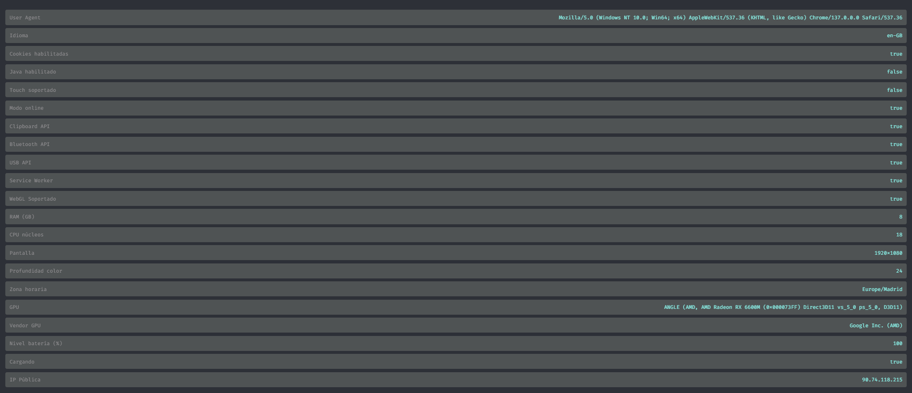
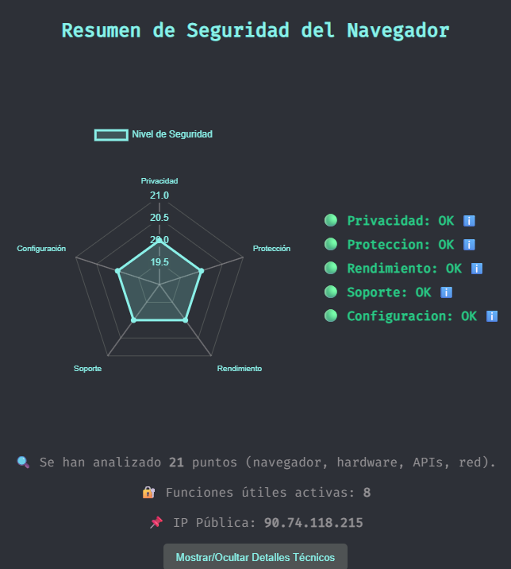
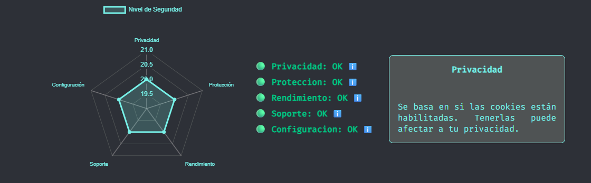
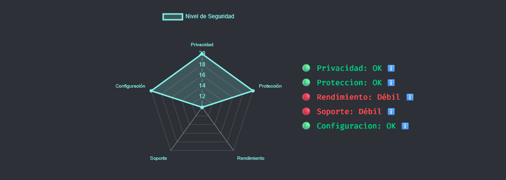

  <a href="https://github.com/cyberiuscompany/Navegator_Inspec">
    
    <strong>Español</strong>
  </a>
  &nbsp;|&nbsp;
  
  <strong>English</strong>
  &nbsp;|&nbsp;
  <a href="https://www.youtube.com/watch?v=xvFZjo5PgG0&list=RDxvFZjo5PgG0&start_radio=1&pp=ygUTcmljayByb2xsaW5nIG5vIGFkc6AHAQ%3D%3D">
    
    <strong>日本語</strong>
  </a>

# Navegator_Inspec

**Lightweight and fast tool to analyze native web browser security directly from the browser itself.**  
- https://cyberiuscompany.github.io/Navegator_Inspec/

---

  

---

## 📋 Description

`Navegator_Inspec` is a web-based tool (PWA) that lets you instantly review your browser's capabilities, features, and security settings — no additional software required.

It detects:

- Sensitive APIs (Bluetooth, USB, Clipboard)
- WebGL capability
- Java enabled or not
- RAM, CPU cores, battery info
- Public IP address
- Privacy and support level
- ...and much more

> ⚙️ Everything runs locally in the user's browser or via GitHub Pages.

---

## 🧭 Key Features

- 📈 Radar with 5 key metrics (Privacy, Protection, Support, Performance, Configuration)
- 🎯 Tooltips explaining each metric
- 📌 Detailed technical view with over 20 analyzed points
- 🔍 Real-time search in technical data
- 📱 PWA application: installable, offline-ready

---

## 📄 Additional Documentation

- [🔐 Security](.github/SECURITY.md)
- [📜 License](LICENSE)
- [🤝 Code of Conduct](.github/CODE_OF_CONDUCT.md)
- [📬 Contributing](.github/CONTRIBUTING.md)
- [📢 Support](.github/SUPPORT.md)
- [⚠️ Legal Notice](DISCLAIMER.md)

---

## 🖼️ Preview

### Main Index

### Technical Reviews

### Main Zoom View (Secure Browser)

### Metrics Click Detail

### Zoom View (Insecure Browser)

---

## 📁 Key Files

| File           | Description                          |
|----------------|--------------------------------------|
| `index.html`   | Main page with browser scanner       |
