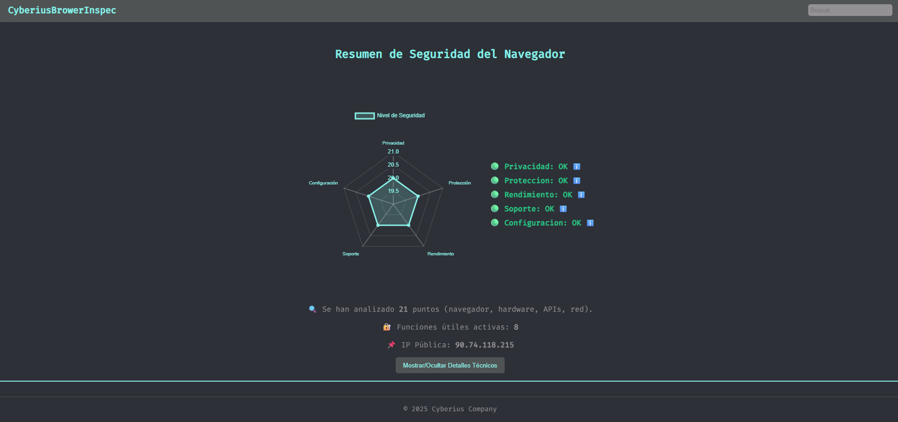
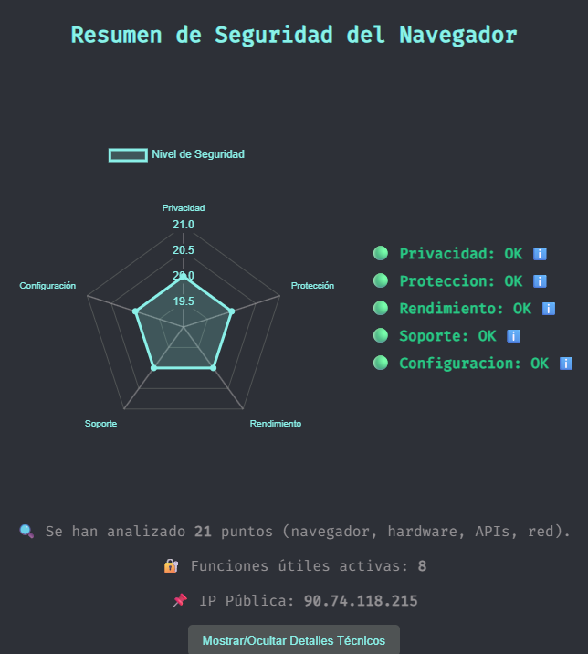
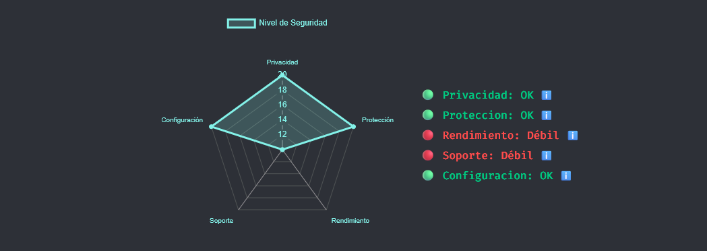

  
  <strong>Español</strong>
  &nbsp;|&nbsp;
  <a href="README.en.md">
    
    <strong>English</strong>
  </a>
  &nbsp;|&nbsp;
  <a href="https://www.youtube.com/watch?v=xvFZjo5PgG0&list=RDxvFZjo5PgG0&start_radio=1&pp=ygUTcmljayByb2xsaW5nIG5vIGFkc6AHAQ%3D%3D">
    
    <strong>日本語</strong>
  </a>

# Navegator_Inspec

**Herramienta ligera y rápida para analizar la seguridad nativa del navegador web directamente desde el propio navegador.**
- https://cyberiuscompany.github.io/Navegator_Inspec/
- 
---

  

 ⚙️ Todo se ejecuta localmente en el navegador del usuario o por medio de la GitHub Pages

---

## 🧭 Características principales

- 📈 Radar de 5 métricas clave (Privacidad, Protección, Soporte, Rendimiento, Configuración)
- 🎯 Tooltip con explicaciones de cada métrica
- 📌 Vista técnica detallada con más de 20 puntos analizados
- 🔍 Buscador en tiempo real entre los datos técnicos
- 📱 Aplicación PWA: instalable, funciona offline

---

## 📄 Documentación adicional

- [🔐 Seguridad](.github/SECURITY.md)
- [📜 Licencia](LICENSE)
- [🤝 Código de Conducta](.github/CODE_OF_CONDUCT.md)
- [📬 Cómo contribuir](.github/CONTRIBUTING.md)
- [📢 Soporte](.github/SUPPORT.md)
- [⚠️ Aviso legal](DISCLAIMER.md)

---

## 🖼️ Vista Previa

### Index Principal

### Revisiones Tecnicas

### Index Zoom Principal (Navegador Seguro)

### Index Zoom Principal (Navegador Seguro)

### Index Zoom Principal (Navegador Inseguro)

---

---

## 📁 Archivos importantes

| Archivo         | Descripción                                        |
|----------------|----------------------------------------------------|
| `index.html`    | Página principal con el escáner                    |

---

